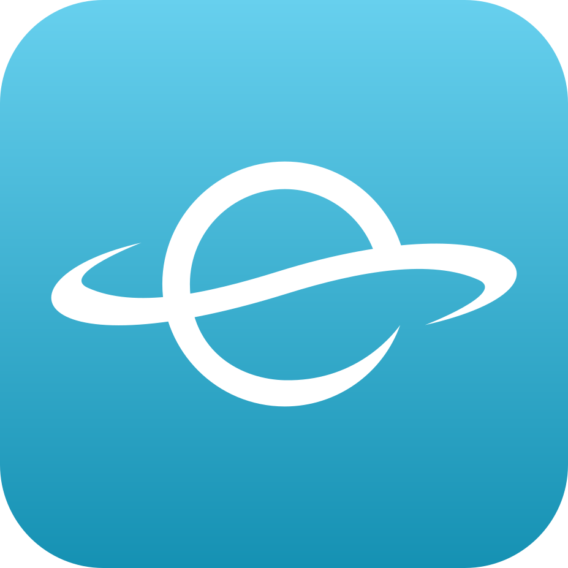
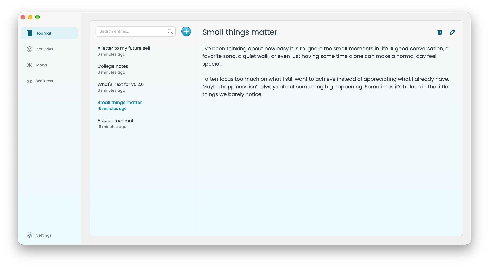
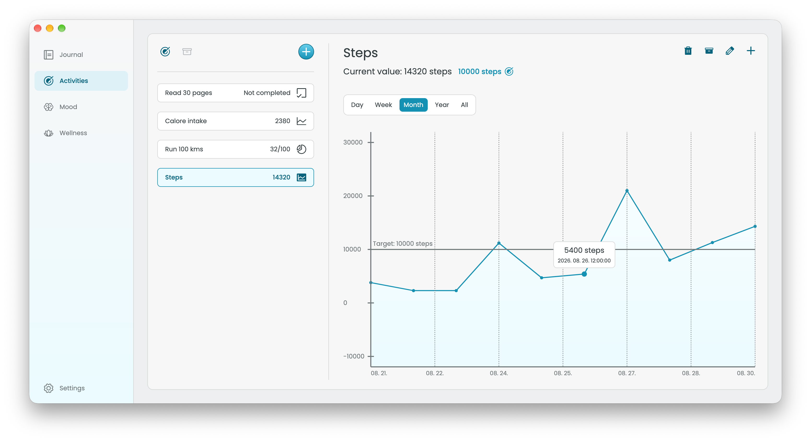
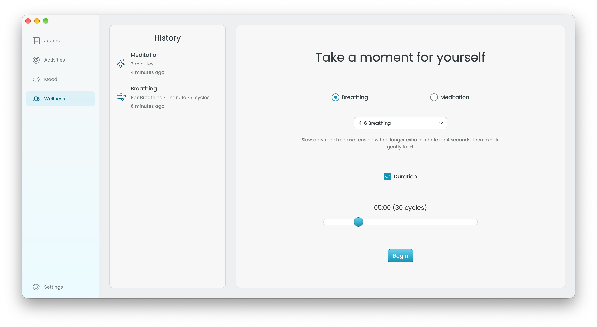
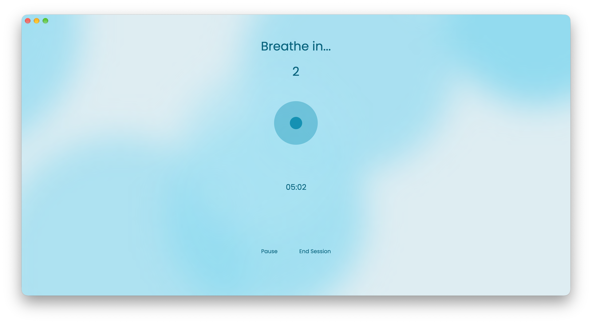

<p align="center">
  
</p>
<h1 align="center">easpace</h1>

**easpace** is a cross-platform, open-source application built with **.NET** and **Avalonia UI**, designed to be a quiet, private space for self-reflection, personal tracking, and wellbeing.

It is built around a simple idea:

> **Your thoughts are yours.**

easpace is not designed to diagnose you, judge your progress, or replace professional mental-health care. Instead, it gives you a private place to notice what is happening in your own life, reflect on it, and build a better understanding of your personal patterns.

There are **no subscriptions, paywalls, ads, or analytics**. **All your data is stored locally** on your device **encrypted** with ChaCha20-Poly1305. 

It's all yours, **for free, forever**.

It will be available for **Windows, macOS, and Linux**, with **iOS and Android** support planned for later versions.

<p align="center">
    
    
    
    
</p>

## Features

* **Journaling:** Write down your thoughts and reflections in a simple, private journal.
* **Mood Tracking:** Record your mood using a simple five-level scale, add notes, and tag emotions to help recognize patterns over time.
* **Activity Tracking:** Create flexible trackers for trends, milestones, and daily routines, with visualisations to help you follow your progress.
* **Wellness:** Take a break with immersive, full-screen breathing exercises and guided meditation sessions.

## Installation

Pre-built packages are currently available for **Windows** and **macOS**. The current release is intended primarily for development and testing rather than as a stable production release.

Linux packages are **not available yet**. They're currently blocked by issues related to securely storing the database encryption key. Linux support is planned for a later version.

### Windows

Download the `.exe` installer matching your system architecture from the [releases](https://github.com/bmartin042503/easpace/releases) page.

> [!WARNING]
> The Windows installer is **not signed with a trusted code-signing certificate**, so Windows SmartScreen may prevent it from running. If you trust the downloaded release and wish to continue, click `More info` → `Run anyway`.

### macOS

Download the `.dmg` file matching your Mac from the [releases](https://github.com/bmartin042503/easpace/releases) page. Open it, and drag **easpace** into the `Applications` folder.

> [!WARNING]
> The application is currently **not signed with an Apple Developer ID certificate or notarized by Apple**, so macOS may prevent it from opening on some systems.

If macOS keeps the downloaded application in quarantine, you can remove the quarantine attribute with:
```bash
xattr -cr /Applications/easpace.Desktop.app
```

## Build from source

To build easpace from source, install:

- [.NET 10 SDK](https://dotnet.microsoft.com/download/dotnet/10.0)
- [Git](https://git-scm.com/)

Clone the repository, navigate to the project directory and restore the dependencies:

```bash
git clone https://github.com/bmartin042503/easpace.git
cd easpace
dotnet restore
```

### Run

To build and run the desktop application directly from source:
```bash
dotnet run --project src/easpace.Desktop/easpace.Desktop.csproj
```

### Build

To create a Release build:
```bash
dotnet build src/easpace.Desktop/easpace.Desktop.csproj -c Release
```

### Publish

easpace can be published as a self-contained application, so the target system does not need to have .NET installed separately.

Use the appropriate runtime identifier (RID) for the system you want to target:
- `win-x64`
- `win-arm64`
- `win-x86`
- `osx-x64`
- `osx-arm64`

```bash
dotnet publish src/easpace.Desktop/easpace.Desktop.csproj \
  -c Release \
  -r osx-arm64 \
  --self-contained true \
  -p:PublishSingleFile=true \
  -p:PublishTrimmed=false \
  -p:PublishAot=false \
  -p:PublishReadyToRun=false
```

## Use of AI

The vast majority of the codebase is written by hand.

AI tools may be used as development assistants for tasks such as:

* organising source code;
* improving documentation;
* assisting with testing;
* exploring implementation approaches;
* assisting with complex UI controls and custom components.

**All generated or AI-assisted code is reviewed, understood, and verified by a human developer before being accepted into the project.**

AI tools are not used as a service for analysing or processing users' private data.

## Contributing

Contributions are currently closed.

Once the project reaches a more mature state, contribution guidelines will be published here.

## Acknowledgements

**easpace** is made possible thanks to these open-source projects:

* [Avalonia UI](https://github.com/AvaloniaUI/Avalonia) - Cross-platform UI framework
* [CommunityToolkit.Mvvm](https://github.com/CommunityToolkit/dotnet) - MVVM architecture toolkit
* [Entity Framework Core](https://github.com/dotnet/efcore) - Object-relational mapper
* [SQLite3 Multiple Ciphers](https://github.com/utelle/SQLite3MultipleCiphers-NuGet) - Database encryption
* [Devlooped.CredentialManager](https://github.com/devlooped/CredentialManager) - Secure local key storage
* [Phosphor Icons](https://phosphoricons.com/) - Iconography

## License

This project is licensed under the [MIT License](./LICENSE).