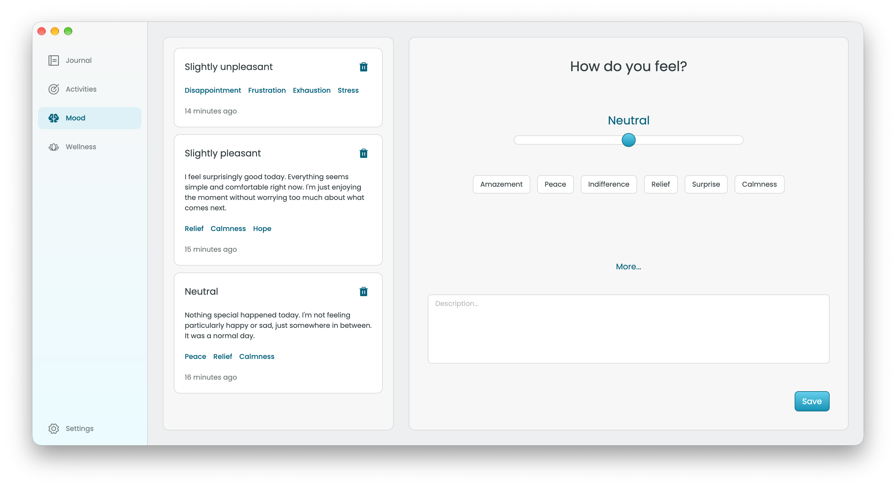

  

<h1 align="center">easpace</h1>

**easpace** is a cross-platform, open-source application built with **.NET** and **Avalonia UI**, designed to be a quiet, private space for self-reflection, personal tracking, and wellbeing.

It is built around a simple idea:

> **Your thoughts are yours.**

easpace is not designed to diagnose you, judge your progress, or replace professional mental-health care. Instead, it gives you a private place to notice what is happening in your own life, reflect on it, and build a better understanding of your personal patterns.

There are **no subscriptions, paywalls, ads, or analytics**. **All your data is stored locally** on your device **encrypted** with ChaCha20-Poly1305. 

It's all yours, **for free, forever**.

It will be available for **Windows, macOS, and Linux**, with **iOS and Android** support planned for later versions.

    
    
    
    
    

## Features

* **Journaling:** Write down your thoughts and reflections in a simple, private journal.
* **Mood Tracking:** Record your mood using a simple five-level scale, add notes, and tag emotions to help recognize patterns over time.
* **Activity Tracking:** Create flexible trackers for trends, milestones, and daily routines, with visualisations to help you follow your progress.
* **Wellness:** Take a break with immersive, full-screen breathing exercises and guided meditation sessions.

## Current Status: v0.1.0 (work in progress)

**easpace is currently in early active development.** The first version is still being built and may contain bugs, incomplete features, and frequent changes.

This first version is intended primarily for development and testing rather than as a stable production release.

## Use of AI

The vast majority of the codebase is written by hand.

AI tools may be used as development assistants for tasks such as:

* organising source code;
* improving documentation;
* assisting with testing;
* exploring implementation approaches;
* assisting with complex UI controls and custom components.

**All generated or AI-assisted code is reviewed, understood, and verified by a human developer before being accepted into the project.**

AI tools are not used as a service for analysing or processing users' private data.

## Contributing

Contributions are currently closed while the first stable version is being developed.

Once the project reaches a more mature state, contribution guidelines and the development process will be published here.

## Acknowledgements

**easpace** is made possible thanks to these open-source projects:

* [Avalonia UI](https://github.com/AvaloniaUI/Avalonia) - Cross-platform UI framework
* [CommunityToolkit.Mvvm](https://github.com/CommunityToolkit/dotnet) - MVVM architecture toolkit
* [Entity Framework Core](https://github.com/dotnet/efcore) - Object-relational mapper
* [SQLite3 Multiple Ciphers](https://github.com/utelle/SQLite3MultipleCiphers-NuGet) - Database encryption
* [Devlooped.CredentialManager](https://github.com/devlooped/CredentialManager) - Secure local key storage
* [Phosphor Icons](https://phosphoricons.com/) - Iconography

## License

This project is licensed under the [MIT License](./LICENSE).